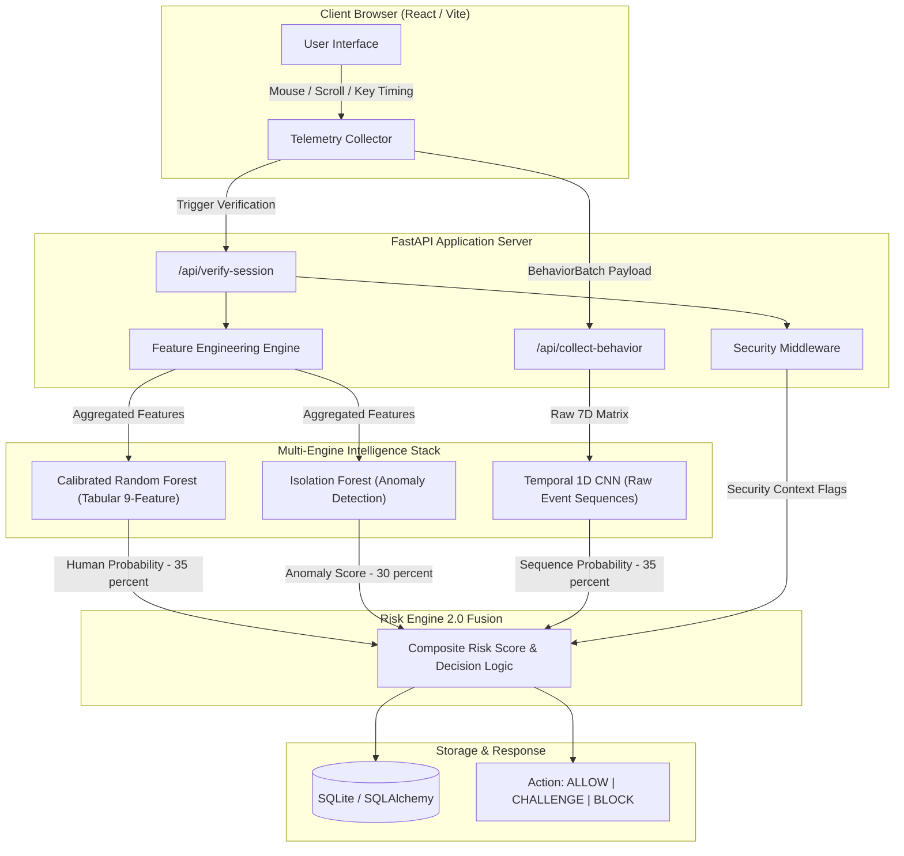
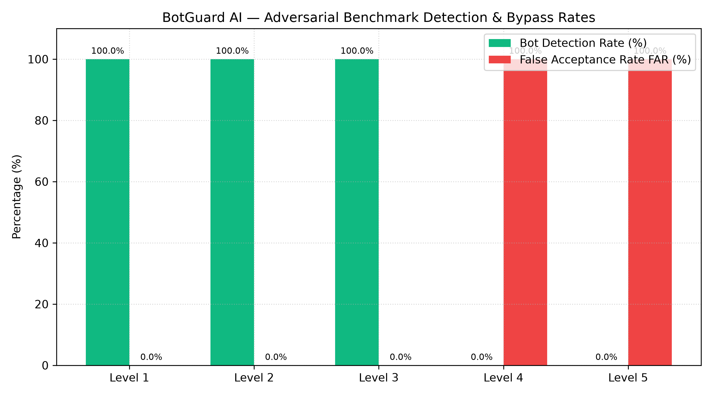
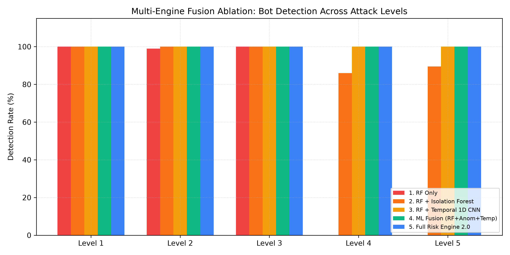
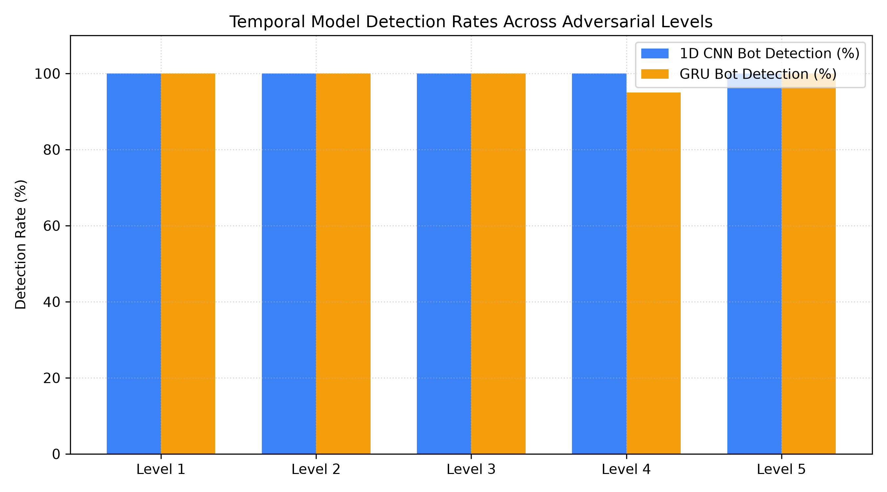

# Behavioral Bot Detection 

> Multi-engine behavioral bot detection using calibrated classification, anomaly detection, temporal modeling for Passive Human Verification.
> 

## 📌 Overview

BotGuard AI is a real-time, privacy-first behavioral biometrics framework designed as a non-intrusive alternative to traditional CAPTCHAs. By analyzing client-side micro-interactions—such as mouse movement speed and acceleration variance, click interval distributions, scroll dynamics, interaction density, and inter-keystroke timing deltas—BotGuard AI evaluates session legitimacy without inspecting typed character content or capturing personally identifiable information (PII).

The core platform combines a **Multi-Engine Intelligence Stack** (Calibrated Random Forest, Isolation Forest Anomaly Detector, and Temporal 1D Convolutional Neural Network) with **Risk Engine 2.0** to deliver adaptive access control decisions (`ALLOW`, `CHALLENGE`, `BLOCK`) with sub-45ms end-to-end latency.


## ✨ Key Features

* **Passive Human Verification:** Offers a non-intrusive alternative to visual CAPTCHAs via continuous background behavioral analysis.
* **Privacy-By-Design Telemetry:** Keyboard telemetry strips character values completely. Only inter-keystroke timing deltas (`dt`) are retained for biometrics.
* **Multi-Engine ML Stack:** Combines supervised tabular classification, unsupervised out-of-distribution anomaly detection, and deep sequence processing.
* **Risk Engine 2.0:** Fuses ML predictions with browser fingerprint indicators, request security context, and automated escalation overrides.
* **Low Latency Pipeline:** Sub-45ms P95 end-to-end inference and evaluation time per verification request.

---

## 🏗️ Architecture Overview



---

## 🧠 Multi-Engine Intelligence Stack

BotGuard AI orchestrates three distinct machine learning engines to prevent single-model evasion:

### 1. Calibrated Random Forest Classifier (`human_bot_model_calibrated.pkl`)
* **Input:** 9 aggregate statistical feature vectors extracted from behavioral batches.
* **Calibration:** Calibrated using Isotonic Regression / Platt Scaling (`CalibratedClassifierCV`) to output true human probabilities.
* **Role:** Detects established statistical signatures of human vs. bot interaction patterns.

### 2. Isolation Forest Anomaly Detector (`anomaly_detector.pkl`)
* **Input:** Unsupervised 9-feature interaction space.
* **Role:** Novelty and out-of-distribution (OOD) detection. Flags automated scripts and zero-day bot frameworks whose statistical distribution strays from baseline human behavior.

### 3. Temporal 1D Convolutional Neural Network (`temporal_model.pt`)
* **Input:** Raw chronologically sorted 7-dimensional event sequence matrix `(T=60, C=7)` representing `(dt_norm, is_mouse, is_click, is_key, is_scroll, spatial_norm, velocity_norm)`.
* **Architecture:** Dual 1D Conv layers with Batch Normalization, ReLU activation, Adaptive Average Pooling, and a Linear classifier.
* **Role:** Evaluates micro-acceleration curves, continuous trajectory dynamics, and sequential timing patterns directly from raw telemetry.

---

## Risk Engine 2.0 & Decision Logic

The **Risk Engine 2.0** fuses predictions from the Multi-Engine stack with real-time security context flags into a composite risk score `R ∈ [0, 100]`.

### Multi-Engine Weight Configuration
* `WEIGHT_RF`: 0.35 (Calibrated Random Forest)
* `WEIGHT_ANOMALY`: 0.30 (Isolation Forest Anomaly Score)
* `WEIGHT_TEMPORAL`: 0.35 (Temporal 1D CNN)

```
      0                                35                              65                             100
      +---------------------------------+-------------------------------+-------------------------------+
      |             ALLOW               |           CHALLENGE           |             BLOCK             |
      |   (Seamless User Experience)    |  (Interactive Math / CAPTCHA) |   (403 Immediate Rejection)   |
      +---------------------------------+-------------------------------+-------------------------------+
```

### Decision Tier Thresholds

| Risk Level | Composite Risk Score Range | System Action | Description |
| :--- | :--- | :--- | :--- |
| **LOW** | `0.0 ≤ Risk < 35.0` | **ALLOW** | Session verified as human. Access granted without interruption. |
| **MEDIUM** | `35.0 ≤ Risk ≤ 65.0` | **CHALLENGE** | Ambiguous behavior detected. Triggers step-up fallback challenge. |
| **HIGH / CRITICAL** | `Risk > 65.0` | **BLOCK** | Bot signature or severe anomaly confirmed. Access blocked immediately. |

---

## Feature Engineering Pipeline

The system computes 9 exact numerical features defined in `backend/services/feature_engineering.py`:

| Feature Name | Primary Signal | Description |
| :--- | :--- | :--- |
| `avg_mouse_speed` | Mouse Speed | Mean pointer movement velocity (`px/s`). |
| `mouse_accel_variance` | Acceleration Wobble | Variance of mouse movement acceleration (`px/s²`). |
| `click_interval_mean` | Click Cadence | Mean interval between consecutive mouse clicks (seconds). |
| `click_interval_std` | Click Variance | Standard deviation of inter-click intervals (seconds). |
| `typing_latency_variance` | Keystroke Timing | Variance of inter-keystroke delays (`dt`) for typing dynamics. |
| `scroll_speed_mean` | Scroll Velocity | Mean scrolling speed (`delta_y/s`). |
| `scroll_accel_mean` | Scroll Acceleration | Mean acceleration of page scrolling interactions. |
| `interaction_density` | Event Rate | Total behavioral events normalized by active session duration (`events/s`). |
| `avg_idle_duration` | Pause Duration | Average duration of idle gaps (`> 1.0 s`) between event clusters. |

---

## Benchmark & Performance Evaluation

Performance metrics derived from `backend/ml/artifacts/fusion_benchmark_metrics.json`:

### Multi-Engine Ablation & Evasion Benchmark

| Model / Fusion Configuration | Human Control (Allow / FRR) | Level 1 Simple Bot | Level 3 Curved Bot | Level 5 Advanced Replay |
| :--- | :--- | :--- | :--- | :--- |
| **1. Random Forest Only** | 100.0% Allow (FRR: 0.0%) | 100.0% Block | 99.5% Block | 0.0% Block (Evasion) |
| **2. RF + Isolation Forest** | 98.5% Allow (FRR: 1.5%) | 100.0% Block | 100.0% Block | 89.5% Challenge / 0.0% Block |
| **3. RF + Temporal 1D CNN** | 100.0% Allow (FRR: 0.0%) | 100.0% Block | 100.0% Block | 100.0% Challenge / 0.0% Block |
| **4. ML Fusion Stack** | 100.0% Allow (FRR: 0.0%) | 100.0% Block | 100.0% Block | 92.0% Challenge / 8.0% Block |
| **5. Full Risk Engine 2.0** | **98.5% Allow (FRR: 1.5%)** | **100.0% Block** | **100.0% Block** | **100.0% Block** |

* **End-to-End Latency:** Mean = 40.66 ms, P95 = 43.07 ms.

---

## Benchmark Visualizations

### Benchmark Detection Rates Across Bot Evasion Levels


### Risk Engine Fusion & Ablation Study


### Temporal 1D CNN vs. Baseline Comparison


---

## 📁 Project Structure & File Layout

```
BotGuardAI/
├── backend/                        # Production FastAPI Backend
│   ├── main.py                     # Application entry point & CORS configuration
│   ├── config.py                   # System threshold & model path settings
│   ├── api/
│   │   └── routes.py               # API endpoints (/collect-behavior, /verify-session, /analytics)
│   ├── database/                   # Database session, base model, & repositories
│   │   ├── base.py                 # Declarative Base
│   │   ├── repository.py           # Database transaction repositories
│   │   └── session.py              # SQLAlchemy engine configuration
│   ├── ml/                         # Multi-Engine Intelligence Stack
│   │   ├── anomaly_detector.py     # Isolation Forest Anomaly Detector wrapper
│   │   ├── calibration.py          # Model calibration utilities
│   │   ├── evaluation.py           # ML evaluation helpers
│   │   ├── intelligence_engine.py  # Multi-Engine Orchestration Stack
│   │   ├── model.py                # Calibrated Random Forest wrapper
│   │   ├── model_registry.py       # Model registry tracking
│   │   ├── temporal_model.py       # PyTorch Temporal 1D CNN implementation
│   │   └── artifacts/              # Production weights & benchmark JSON metrics
│   │       ├── anomaly_detector.pkl
│   │       ├── fusion_benchmark_metrics.json
│   │       ├── human_bot_model_calibrated.pkl
│   │       ├── model_registry.json
│   │       └── temporal_model.pt
│   ├── models/                     # Schemas and DB Entities
│   │   ├── db_models.py            # SQLAlchemy table definitions
│   │   └── schemas.py              # Pydantic schemas
│   ├── security/
│   │   └── risk_engine.py          # Risk Engine 2.0 fusion & escalation logic
│   └── services/                   # Service layer
│       ├── decision_engine.py      # Session evaluation bridge
│       ├── feature_engineering.py  # 9-feature extraction module
│       ├── feature_store.py        # Feature vector persistence
│       ├── logging_service.py      # Evaluation logging & analytics reader
│       ├── metrics.py              # Prometheus latency/outcome metrics
│       └── security_middleware.py  # Security context middleware
├── frontend/                       # Client Telemetry & Dashboard (React + Vite)
│   ├── src/                        # Behavioral tracking hooks & UI components
│   ├── package.json
│   └── vite.config.js
├── alembic/                        # Alembic Database Migrations
├── docs/                           # Documentation & Benchmark Plots
│   ├── architecture.md
│   └── assets/                     # Retained benchmark plots (.png)
├── scripts/                        # Evaluation & Benchmark Scripts
│   ├── evaluate_fusion.py          # Multi-Engine ablation runner
│   ├── run_bot_benchmark.py       # Bot benchmark generator
│   └── train_temporal_experiment.py # Temporal CNN training script
├── tests/                          # Automated Pytest Suite
├── requirements.txt                # Python Backend Dependencies
└── README.md                       # Engineering Documentation
```

---

## ⚡ Quick Start

### 1. Repository Setup
```bash
git clone https://github.com/QuirkyNerd/BotGuardAI.git
cd BotGuardAI
```

### 2. Backend Setup
```bash
# Create and activate Python virtual environment
python -m venv venv

# On Windows (PowerShell):
.\venv\Scripts\Activate.ps1
# On Linux/macOS:
# source venv/bin/activate

# Install required dependencies
pip install -r requirements.txt

# Run database migrations
alembic upgrade head
```


### 3. Running the Backend Server
```bash
python -m uvicorn backend.main:app --reload --port 8000
```
* **API Server:** `http://127.0.0.1:8000`
* **Swagger Documentation:** `http://127.0.0.1:8000/docs`
* **Health Check:** `http://127.0.0.1:8000/health`

### 4. Frontend Setup
In a separate terminal:
```bash
cd frontend
npm install
npm run dev
```
* **Frontend App:** `http://localhost:5173`

---

## API Endpoint Reference

| Endpoint | Method | Description |
| :--- | :--- | :--- |
| `/api/collect-behavior` | `POST` | Ingest raw behavioral telemetry batch. |
| `/api/verify-session` | `POST` | Compute human confidence score and composite risk decision. |
| `/api/analytics` | `GET` | Retrieve session statistics and risk classification metrics. |
| `/api/explain/{session_id}` | `GET` | Retrieve feature importances for a verified session. |
| `/api/challenge/start` | `POST` | Initiate a step-up fallback challenge when risk is `CHALLENGE`. |
| `/api/challenge/verify` | `POST` | Validate solution for a triggered challenge. |
| `/api/simulate-bot` | `POST` | Generate simulated bot telemetry for integration testing. |
| `/api/session/{session_id}/heatmap` | `GET` | Build mouse-movement heatmap grid for a session. |
| `/api/protected-resource` | `POST` | Sample endpoint demonstrating risk-based access control blocking. |

---

## 📄 License

This project is developed for academic and research demonstration purposes under the MIT License.

© 2026 Behavioral Bot Detection

---

